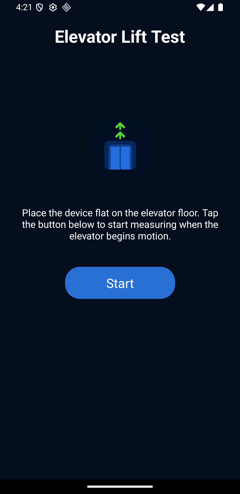

# Elevator Lift Test

[Português](./read-me.pt-BR.md)

This app measures velocity, acceleration, jerk, and ambient noise of an elevator while it is moving.
It uses the device's accelerometer and microphone to collect and analyze data in real-time.



## How It Works

The app calculates the following metrics using the device's sensors:

1. **Acceleration**: Derived from the accelerometer data (x, y, z axes).

   ```math
   a = \sqrt{x^2 + y^2 + (z - g_{\text{offset}})^2}
   ```

   Where:

   - `x, y, z` are the raw accelerometer values.
   - `g_{\text{offset}}` is the gravity offset calibrated at the start of measurement.

2. **Velocity**: Calculated by integrating acceleration over time.

   ```math
   v = v_0 + a \cdot \Delta t
   ```

   Where:

   - `v_0` is the initial velocity (assumed to be 0).
   - `\Delta t` is the time interval between measurements.

3. **Jerk**: The rate of change of acceleration.

   ```math
   j = \frac{a - a_0}{\Delta t}
   ```

   Where:

   - `a_0` is the previous acceleration value.

4. **Ambient Noise**: Measured in decibels (dBFS) using the device's microphone.

## University Project

This app was developed as part of a university project at **Estácio de Sá**, Brazil.

## License

Licensed under **GPLv3**.

## Contact

- **Name**: David Martins dos Anjos
- **Email**: [contato@davidmartins.net](mailto:contato@davidmartins.net)
