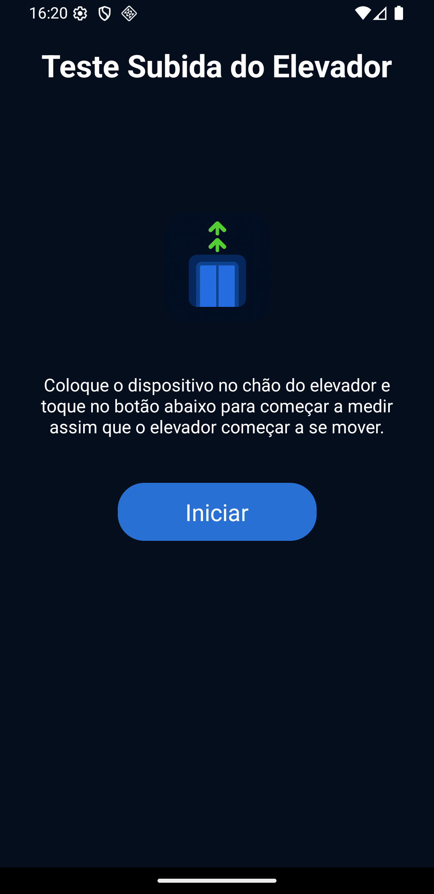

# Elevator Lift Test

[English](./readme.md)

Este aplicativo mede velocidade, aceleração, tranco e ruído ambiente de um elevador enquanto ele está em movimento.
Ele utiliza o acelerômetro e o microfone do dispositivo para coletar e analisar dados em tempo real.

## Como Funciona

O aplicativo calcula as seguintes métricas usando os sensores do dispositivo:

1.  **Aceleração**: O aplicativo isola a **aceleração vertical** (movimento na direção da gravidade). Ele funciona da seguinte forma:

    - Determinando a direção precisa da gravidade ao comparar os dados brutos de aceleração com a aceleração total (que inclui a atração da gravidade).
    - Projetando a aceleração linear do dispositivo na direção da gravidade calculada. Isso filtra o movimento horizontal e isola a verdadeira aceleração vertical do elevador.
    - Uma pequena _deadband_ (zona morta) é aplicada ao valor final para evitar que o ruído do sensor cause desvios quando o elevador está parado.

    A aceleração vertical ($a_{\text{vert}}$) é conceitualmente calculada como o produto escalar do vetor de aceleração linear ($\vec{a}_{\text{lin}}$) e o vetor de gravidade normalizado ($\hat{g}$).

    $a_{\text{vert}} = \vec{a}_{\text{lin}} \cdot \hat{g}$

2.  **Velocidade**: Representa a **velocidade vertical**, que é calculada integrando numericamente a aceleração vertical ao longo do intervalo de tempo entre as medições.

    $v = v_{\text{prev}} + a_{\text{vert}} \cdot \Delta t$

    Onde:

    - $v_{\text{prev}}$ é a velocidade da medição anterior.
    - $a_{\text{vert}}$ é a aceleração vertical atual.
    - $\Delta t$ é o tempo decorrido desde a última medição.

3.  **Tranco**: É a taxa de variação da **aceleração vertical**, que quantifica a suavidade do movimento do elevador.

    $j = \frac{a_{\text{vert}} - a_{\text{vert, prev}}}{\Delta t}$

    Onde:

    - $a_{\text{vert, prev}}$ é a aceleração vertical da medição anterior.

4.  **Ruído Ambiente**: Mede o volume do som ambiente dentro do elevador usando o microfone do dispositivo. A medição é fornecida em **decibéis relativos à escala máxima (dBFS)**, o que indica a amplitude do sinal de áudio em comparação com o nível máximo que o dispositivo pode registrar.

## Projeto Universitário

Este aplicativo foi desenvolvido como um trabalho de extensão universitário na **Estácio de Sá**, Brasil.

## Licença

Licenciado sob **GPLv3**.

## Contato

- **Nome**: David Martins dos Anjos
- **Email**: [contato@davidmartins.net](mailto:contato@davidmartins.net)
