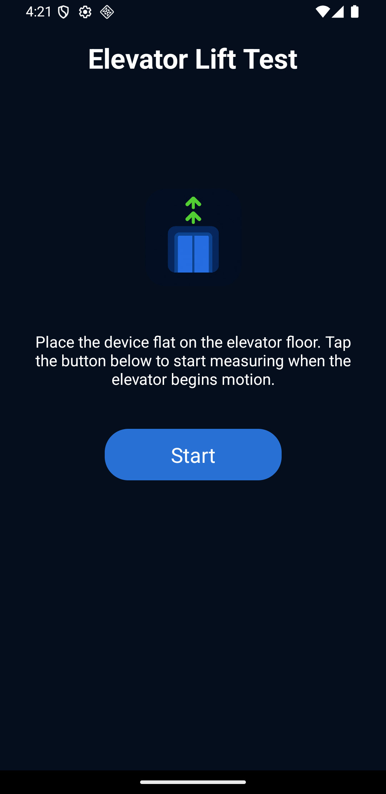

# Elevator Lift Test

[English](./readme.md)

Este aplicativo mede velocidade, aceleração, tranco (derivada da aceleração) e ruído ambiente de um elevador enquanto ele está em movimento.
Ele utiliza o acelerômetro e o microfone do dispositivo para coletar e analisar dados em tempo real.



## Como Funciona

O aplicativo calcula as seguintes métricas usando os sensores do dispositivo:

1. **Aceleração**: Derivada dos dados do acelerômetro (eixos x, y, z).

   ```math
   a = \sqrt{x^2 + y^2 + (z - g_{\text{offset}})^2}
   ```

   Onde:

   - `x, y, z` são os valores brutos do acelerômetro.
   - `g_{\text{offset}}` é o ajuste de gravidade calibrado no início da medição.

2. **Velocidade**: Calculada pela integração da aceleração ao longo do tempo.

   ```math
   v = v_0 + a \cdot \Delta t
   ```

   Onde:

   - `v_0` é a velocidade inicial (assumida como 0).
   - `\Delta t` é o intervalo de tempo entre as medições.

3. **Tranco**: A taxa de variação da aceleração.

   ```math
   j = \frac{a - a_0}{\Delta t}
   ```

   Onde:

   - `a_0` é o valor anterior da aceleração.

4. **Ruído Ambiente**: Medido em decibéis (dBFS) usando o microfone do dispositivo.

## Projeto Universitário

Este aplicativo foi desenvolvido como um trabalho de extensão universitário na **Estácio de Sá**, Brasil.

## Licença

Licenciado sob **GPLv3**.

## Contato

- **Nome**: David Martins dos Anjos
- **Email**: [contato@davidmartins.net](mailto:contato@davidmartins.net)
